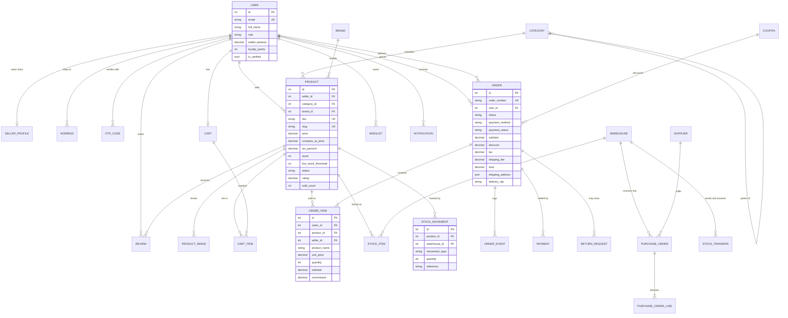

# ER diagram

Paste into any Mermaid renderer (GitHub renders it natively, or use mermaid.live).

## Reading the diagram

The three relationships worth noting:

1. **A user is one row, not five tables.** `role` decides whether the same person sees a
   storefront, a seller dashboard, or a warehouse console. That keeps auth simple and lets an
   admin promote an account without migrating data.
2. **Order items snapshot the product.** `product_name`, `unit_price` and `commission` are copied
   at checkout, so editing a listing later never rewrites financial history.
3. **Stock has two sources of truth, kept in sync.** `PRODUCT.stock` is the fast number the
   storefront reads; `STOCK_ITEM` (per warehouse) plus `STOCK_MOVEMENT` (the ledger) are what the
   warehouse team works from. Every checkout, cancellation and goods receipt writes both in one
   transaction.
